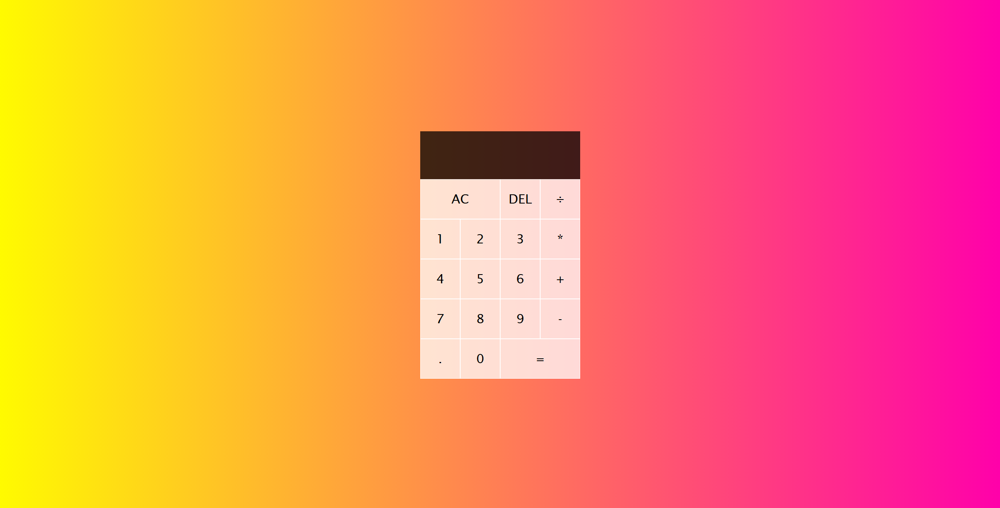
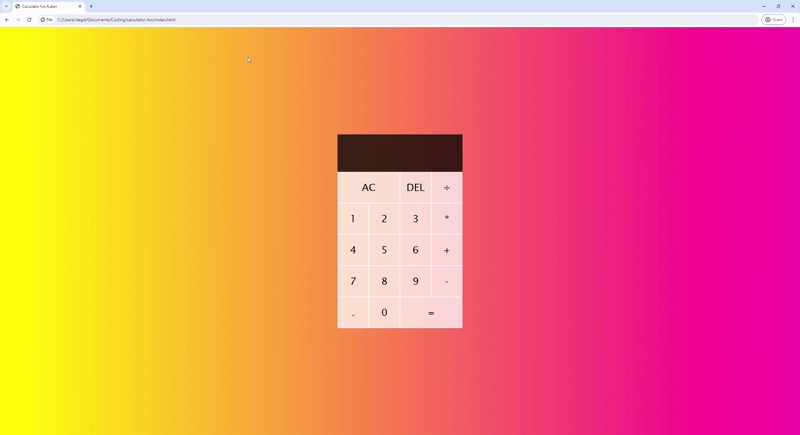

# calculator-fun
if you use the js version without typescipt you can already use the simple calculator as is

If you run the typescript version, follow commands below

1. run tsc index.ts
2. npm run build or webpack

