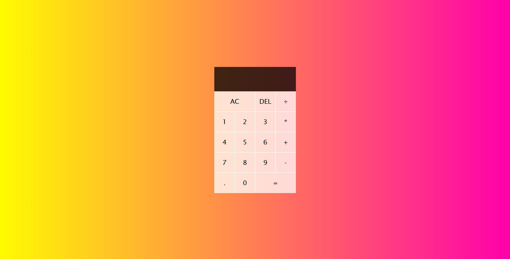
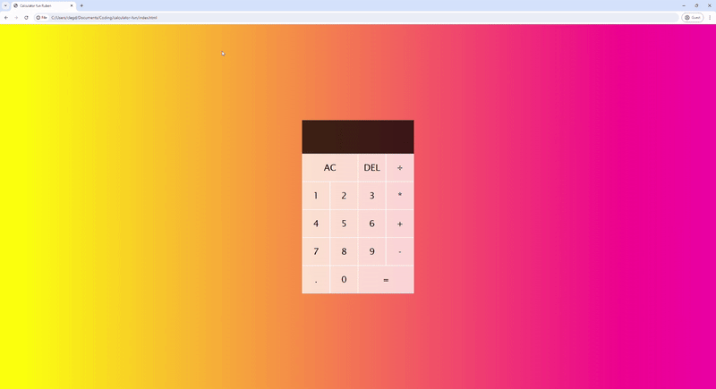

# calculator-fun

A calculator in TypeScript: real operator precedence, a ƒ(x) grapher,
keyboard support, memory keys, a persistent history panel, light/dark themes,
tests, type checking, Docker and CI.




## Layout

```
ts/
  expression.ts       tokenizer, shunting-yard, RPN evaluator
  exact.ts            exact arithmetic on BigInt: fractions, surds, pi
  exact-evaluator.ts  the same RPN, evaluated exactly where it can be
  format.ts           how an expression and a result are spelled
  calculator.ts       the facade the UI talks to, no DOM
  expression-buffer.ts  the text being edited, and the caret in it
  history-log.ts      past calculations
  entry-recall.ts     the list the up and down arrows walk, and where in it
  memory-register.ts  the M keys
  environment.ts      the angle mode, Ans and the letters: what survives AC
  exact-result.ts     the last answer's exact reading, and the form it is in
  graph.ts            samples functions across a range
  analysis.ts         roots, intersections and turning points
  function-series.ts  the four Y expressions, shared by the graph and table
  stats.ts            one-variable figures and least-squares regression
  stat-lists.ts       the two lists behind the Stats tab
  matrix.ts           matrix arithmetic: determinant, inverse, the rest
  matrices.ts         the two grids behind the Matrix tab
  listeners.ts        the callback list those three stores share
  storage.ts          localStorage, guarded
  theme.ts            light/dark
  index.ts            composition root: builds the parts and wires them
  ui/                 one module per region of the page
    keypad.ts         the action registry, the 2nd layer, the keyboard
    display.ts        the expression and result lines
    history-panel.ts  |
    register-panel.ts |  the six side-panel tabs
    graph-panel.ts    |
    table-panel.ts    |
    stats-panel.ts    |
    matrix-panel.ts   |
    graph-shapes.ts   the SVG the graph draws, as named pieces
    graph-search.ts   root, min, max, intersect, slope and area
    graph-window.ts   how a window is sized and how a bound is written
    graph-readout.ts  the trace wording
    read-number.ts    reading a number out of a field
  *.test.ts           unit tests
  types/              one type alias per file
  interfaces/         one interface per file
  enums/              one enum per file
e2e/                Playwright specs (real browser)
docker/             Dockerfile + nginx config
public/             copied verbatim into the build (favicon)
index.html          the page
```

Types, interfaces and enums each live in their own directory, one declaration
per file. No type or interface is declared anywhere else — `calculator.ts` and
`index.ts` import theirs with `import type`, which `verbatimModuleSyntax`
erases entirely, so nothing extra is loaded at runtime.

The calculator logic is kept free of the DOM, so it can be tested without a
browser. `Calculator` is a facade: it owns no text, history, entry list,
evaluation context or exact answer of its own but delegates each to a small
class that does, which is what keeps it from growing into one thousand-line
class. Everything that
touches elements and listeners lives under `ts/ui/`, and `ts/index.ts` builds
those parts and hands them to each other — it makes no decisions itself.

Each UI module takes an `AbortSignal`, so every listener it adds comes off
together.

## Running it

```bash
npm install
npm run dev          # http://localhost:5173 -- hot reload, no build needed
```

For a production-style build:

```bash
npm run build        # tsc -> dist/, then serve the folder
```

Vite builds the site and serves it in development. `tsc` is the type checker
and emits nothing.

That split is what lets the source use `@/…` aliases and `.ts` import
specifiers: `tsc` rewrites neither — it will not even emit an aliased `.ts`
import, it errors — so a bundler has to resolve them.

```ts
import { Calculator } from "@/calculator.ts";
import type { Operation } from "@/types/operation.ts";
```

`@` is `ts/`, declared in `tsconfig.json` (for the checker), `vite.config.ts`
(for the build and dev server) and `vitest.config.ts` (for the tests).

## Features

**Operator precedence and parentheses.** `2 + 3 * 4` is `14`, not `20`.
Expressions are tokenized and ordered with the shunting-yard algorithm, then
evaluated as postfix, so `2^3^2` is `512` (right-associative) and `-2^2` is
`-4`. `(` and `)` keys override precedence, a badge shows how many are open,
and any left open are closed for you when you press `=`.

**Live preview.** The upper line shows the expression as typed; the lower line
shows its value as soon as it is valid, so precedence is visible as you go.

**ƒ(x) grapher.** The second tab plots up to four functions of `x` as inline
SVG — no charting library. Supports `sin cos tan sqrt abs ln log`, `π`, `e`,
implied multiplication (`2x`, `3(x+1)`), the stored registers, and an
adjustable range. `Y1` to `Y4` each get their own colour, matched by the label
beside the field. Discontinuous functions such as `1/x` and `tan(x)` are drawn
as separate curves rather than joined by vertical streaks, and the cutoff that
splits them is measured per series, so one steep curve does not chop up its
neighbours.

Hover, or drag a finger, to trace whichever curve is nearest the pointer; the
readout names it, as `Y2   x = 1.5   y = 2.99`. The `◀` `▶` chips step the
trace along, and `zoom +` / `zoom −` / `reset` move the window.

**Graph analysis.** `root`, `min`, `max` and `intersect` run numeric searches
over the visible range and drop the trace marker on what they find:

- **root** scans for a sign change and bisects it. A sign change is only
  accepted once the curve is shown to shrink towards it, so the pole in
  `1/(x-3)` — which flips sign just as a root does — is skipped rather than
  reported, and the search carries on to any genuine root beyond it. The `y`
  shown is `0`, because that is what a root's value is; the `-4.4e-16` the
  float actually leaves behind is its error bar, not the answer.
- **min** / **max** take the best sample of a coarse scan and refine it with a
  ternary search, then round the `x` as far as the curve allows — so the vertex
  of `x²-2` reports `x = 0` rather than `x = 1.054e-8`. The rounding never
  leaves the window: on a curve with no turning point the answer sits on the
  edge of the range, and rounding outwards would answer with a point that is
  not in view. Samples running up an asymptote are left out, using the same
  cutoff that decides where the chart stops drawing — a maximum the plot
  refuses to draw would put the marker where there is no curve.
- **intersect** is a root of the difference of the two curves, and needs two
  of them; it says so when only one is drawn.

**Slope and area.** `dy/dx` reports the gradient where the trace is sitting, or
at the middle of the window if no trace is running. `∫ƒ(x)dx` measures the area
between the curve and the axis across the whole window and shades what it
counted, so the number on screen has a picture beside it — the area under
`sin(x)` from `0` to `π` is `2`, and looks it.

The slope is a central difference whose step is scaled to `x`, because a step
that is sensible at `x = 1` disappears into the gap between neighbouring
doubles at `x = 1e8`. Two things are checked before an answer is given, since a
central difference will happily average its way across a point where no slope
exists:

- **A corner.** The two one-sided slopes are compared at the step and at half
  the step. Curvature makes them disagree in proportion to the step, so halving
  it halves the disagreement; a corner keeps the whole turn however small the
  step gets. Judging the disagreement against a fixed size instead condemns any
  curve that bends sharply — `100x²` at zero is flat, not a corner.
- **A jump.** Both sides of one agree on an enormous slope, so the corner test
  sees nothing; what gives it away is that the answer doubles when the step
  halves instead of settling.

The two differences are then combined so their leading errors cancel, which is
what keeps the answer good at a large `x` where the step is coarse.

The area is **adaptive** Simpson's rule: each interval is compared against its
own two halves, and where they disagree the interval is split and tried again.
That adaptation is what tells a hard integral from an impossible one — the
square root at the left end of `sqrt(x+10)` needs a great many small intervals
and gets them, while an asymptote never converges however far it is split and
is refused, because the area there is infinite.

The test is run on the absolute value as well, because that is the one that
cannot be fooled by symmetry: `tan(x)` across a window centred on zero makes
every estimate exactly zero — the infinity on the left cancels the one on the
right at every level — so nothing ever disagrees and a check on the signed
total alone accepts the first interval whole and reports an area of `0`.

Areas above and below the axis cancel, and what survives an exact cancellation
is the float's error bar rather than an area, so `∫x dx` across a window centred
on zero is `0` and not `3.6e-15`. That bar is set by how much area was added up
to reach the answer, not by how much there could have been — a curve reaching
`1e8` can still have a real area of `6e-5`.

Searches run over the window, so zooming in on a region is how you pick which
root or turning point you want. Moving the window drops the shading with it —
a region and a total that described the old window are not an answer about this
one — and so does storing a value the curve uses, since that changes what the
curve is. Zooming keeps the marker where it is, unless
the new window no longer contains it — then the trace is dropped rather than
left describing a point off the edge.

**Function table.** The Table tab is the same four functions read off as
numbers: a column per function that has something in it, a row per step of `x`,
with a configurable start and `Δx`. The `▲` `▼` chips move a page at a time
rather than the table growing without end, so a `Δx` of `0.001` does not try to
render a million rows. A value the function has no answer for shows as `—`
rather than `NaN`, and one that will not parse says `error` in its own column
instead of blanking the table.

The graph and the table are two views of one set of functions, so typing into
`Y2` on the ƒ(x) tab reaches both.

**Statistics.** The Stats tab holds two lists, edited as rows. A row needs both
values to count as a point; one on its own still counts towards its own column.
Below the editor, each column gets the figures the hardware reports — `n`, `Σx`,
`Σx²`, `x̄`, `σ`, `s`, `min`, `Q1`, `med`, `Q3`, `max` — recomputed as you type.
Quartiles follow the hardware too: the lower quartile is the median of the
values below the median, and for an odd count the median belongs to neither
half.

`σ` divides by `n` and `s` by `n-1`. A single value has no `s` at all — one
number says nothing about how far apart numbers are — and shows `—` rather than
a zero it has not earned.

**Regression.** The least-squares line through the paired rows is shown as you
type, with `r` and `r²`. `plot & fit` puts the line in the first free ƒ(x) slot,
fits the window to the data and draws the scatter. There is no line when there
is nothing to fit: fewer than two paired rows, or every `x` the same — a
vertical line has no slope, and a huge number would be a worse answer than
saying so.

The scatter is read from the lists rather than copied, so editing a value moves
its point and clearing the lists takes the scatter with it. While data is on the
chart the window frames the data, and a curve that does not fit is clipped —
sharing a scale with an unrelated `x²` would squash a scatter of 2 to 5 into a
band along the bottom. The `data` chip on the ƒ(x) tab turns the scatter off
again, which is what puts an ordinary curve back on its own scale.

`r` is left blank when `y` does not vary. The flat line through constant data is
a perfect fit and its slope is worth having, but `r` is `0/0` there, and
reporting `1` would assert a positive relationship that a slope of zero denies.
An intercept that is only the residue of a cancellation is reported as `0`:
data lying exactly on `y = 2.1x` leaves `-8.9e-16` behind, which is the float's
error bar rather than an intercept.

**Matrices.** The Matrix tab holds two grids, A and B, up to 4×4, with the
operations that need more than one of them (`A+B`, `A−B`, `A×B`) and the ones
that need only one (transpose, determinant, inverse). Changing the size keeps
whatever still fits, so growing a matrix does not clear what has been typed.
The answer follows the grids: edit a cell and the determinant on screen is the
determinant of what is now in the grid, not of what was there when the button
was pressed.

Matrices stay out of the expression engine — there is nowhere in `2 + 3` for a
grid to go — so everything happens in the panel and the answer is shown there.

An operation that cannot be done says why: matrices of different sizes cannot
be added, `A×B` needs A as wide as B is tall, only a square matrix has a
determinant or an inverse, and a singular one has no inverse at all. Producing
a grid full of infinities would be worse than saying so.

The determinant uses fraction-free (Bareiss) elimination rather than ordinary
LU, because every division it performs comes out exact: a matrix of whole
numbers gives a whole number back, so a determinant of 6 is `6` and not
`5.999999999999998`. Whole answers are printed whole however long they are —
a determinant of `-137266786` is the exact answer, and rounding it to eight
digits on the way to the screen would throw away what the algorithm was chosen
to protect.

The inverse uses Gauss-Jordan with partial pivoting, and the threshold for
"this pivot is zero" is relative to the pivot's own row. An absolute one would
call a matrix of millionths singular; one measured against the largest entry
anywhere would refuse `[[1e12, 0], [0, 1]]`, whose inverse is exactly
representable and whose determinant the same module reports as `1e12`.

Changing a size takes effect when the field settles rather than on each
keystroke, because typing `12` passes through `1` — and resizing a 4-row
matrix down to one row on the way would throw three rows away that growing
back cannot recover.

**Repeat equals.** `5 + 3 =` gives 8; press `=` again for 11, and again for 14.

**Themes.** Light and dark, toggled in the header and remembered.

**Everything persists.** History, memory, the statistics lists, the matrices
and the theme survive a reload via
`localStorage`, guarded so a private window or a full quota degrades to "no
saved state" rather than breaking.

**Keyboard** — the whole calculator is usable without the mouse:

| Key | Action |
| --- | --- |
| `0`-`9` `.` | digits |
| `+` `-` `*` `/` | operators (`/` maps to the `÷` key) |
| `^` | power |
| `(` `)` | parentheses |
| `%` | percent |
| `←` `→` | move the caret |
| `↑` `↓` | walk back and forward through past entries |
| `Enter` or `=` | compute |
| `Backspace` | undo the last keypress |
| `Escape` | clear |

The matching on-screen key flashes, so the mapping is visible. A focused button
keeps handling its own `Enter`, so nothing fires twice.

**Percent** behaves like a physical calculator: inside a pending `+` or `-` it
reads as "percent of the first operand", so `50 + 10 %` is `55`, not `50.1`.
Inside `*` or `÷` there is no sensible base, so it is a plain division by 100.

**Editing.** A caret sits in the expression line and `←`/`→` move it, so a
typo in the middle is one keystroke to fix rather than a retype. `↑`/`↓` walk
through previously computed expressions, which can then be edited and run
again. The same four moves have keys of their own for touch.

`DEL` undoes one *keypress* while the caret is at the end -- so the `√` key
takes one press to undo, not five. Once the caret has been moved, editing is
character-wise, as in any text field.

**`Ans`** inserts the previous result, so a long calculation can be carried
forward: `5 × 7 =` then `Ans + 1 =` gives 36.

**Exact answers.** Results that have an exact form are shown that way rather
than rounded: `1/3 + 1/6` is `1/2`, `√8` is `2√2`, `sin 45°` is `√2/2`, and
`π/4` stays `π/4`. An `EXACT` badge marks it, and `2nd` + `n/d` is `F⇔D`,
which swaps to the decimal and back.

An answer keeps the form of the question, as it does on the hardware: ask in
fractions and get a fraction, ask in decimals and get a decimal.

Values of the form `(a·√b·π^k)/c` are covered, held in `BigInt` so nothing
rounds. Anything outside it — `ln 5`, `sin 1`, `√2 + √3` — has no exact form
and falls back to the decimal automatically. The exact value is also what gets
carried into the next calculation, so continuing from a displayed `1/3` and
multiplying by 3 gives exactly `1` rather than `0.999999999999`.

`n/d` starts a fraction, and the history shows whichever form was on screen.

**Mixed numbers.** `2nd` + `1/x` is `U n/d`, which lays out a whole part and a
fraction: type the whole number, `▶`, the numerator, `▶`, the denominator. The
answer comes back the way the question was asked, so `2 1/3 + 1` is `3 1/3`
while `7/3` on its own stays `7/3`.

The template is written out as the sum it is — `(2 + 1/3)` — because the
expression line is plain text and this calculator multiplies by juxtaposition,
so a space-separated `2 1/3` would read as 2 × 1/3. The answer has no such
problem: `2 1/3` is a result, not something to be parsed back.

The whole part may be left out, since a leading `+` says nothing about a value.
`DEL` on a template nobody has typed into yet takes the whole template, rather
than one bracket off it.

**Scientific notation.** `2nd` + `.` is `EE`, which starts the exponent of a
number: `2` `EE` `5` is `2e5`, or 200,000. `±` right after `EE` makes the
exponent negative, as does the `-` key.

The sign belongs to the number, so `2e-3` stays one value: it is not spaced out
into `2e - 3`, and pressing `=` twice does not go on subtracting three. Once
the exponent has digits in it the number is a number again, and `±` means what
it always means — negating `1e-7` gives `-1e-7`, not `1e7`.

With nothing to attach to, `EE` gives `1e`: a bare `e` is Euler's constant, and
the key would otherwise be a second way to type it rather than a power of ten.
For the same reason a number takes only one exponent, and no decimal point
inside one — `1e1e3` and `2e.5` are both things the parser reads happily as
something else, and report no error about.

**Stored values.** The Vars tab keeps four registers, `A` to `D`: store what
is on the display, then use the letter in any expression, including in the
ƒ(x) field. The letters are uppercase and are matched before function names,
so `Asin(30)` is A×sin(30) rather than `asin(30)`. `E` and `X` are not offered
because the parser already reads those as Euler's constant and the graph
variable, and a letter cannot mean two things at once.

**Probability.** `nCr` and `nPr` are infix, as they are on the hardware —
`52 nCr 5` is `2,598,960` — which is why the parser needs no multi-argument
functions and no comma. `!` is postfix and binds to the value before it, so
`2 × 3!` is 12. `rand` inserts a random value at the moment it is pressed,
rather than re-rolling on every evaluation, so the preview does not flicker
and the answer matches what was on screen.

**Scientific keys**: `√`, `x²`, `1/x`, `xⁿ`, `π`, `sin`, `cos`, `tan`, `log`,
`ln`, plus `±` to flip a sign.

**Angle modes.** The `mode` key cycles RAD → GRAD → DEG, shown as a badge on the
display and remembered across reloads. Trigonometry reads its argument in the
active mode and the inverses report their result in it, so `cos(60)` is `0.5` in
degrees and `-0.952…` in radians. Graphs are always drawn in radians, whatever
the keypad is set to.

The engine also understands `sinh`, `cosh`, `tanh` and `exp`, which have no key
of their own but can be typed into the ƒ(x) field.

**A `2nd` shift layer**, as on the reference hardware. Pressing `2nd` swaps the
legends of the keys that carry an alternate, and the shift is spent by the very
next action -- a key, a keystroke, or a click anywhere else on the page:

| Key | `2nd` gives |
| --- | --- |
| `sin` `cos` `tan` | `sin⁻¹` `cos⁻¹` `tan⁻¹` |
| `log` | `10ˣ` |
| `ln` | `eˣ` |
| `√` | `abs(` |
| `π` | `e` (Euler's constant, inserted as `(e)` so it cannot read as an exponent) |
| `MC` | `CH`, clear history |

`DEL` undoes one *keypress*, not one character, so a single press removes the
whole of `sqrt(` or `(e)`.

**Memory** (`MC` `MR` `M+` `M-`) with an `M` indicator on the display while
memory holds a non-zero value. Memory survives `AC`.

**History** lists completed sums, newest first, capped at 50. Click an entry to
load its result back into the display. History survives `AC` and has its own
Clear button. A failed sum is not recorded.

**Results are rounded** to 12 significant digits, so `0.1 + 0.2` shows `0.3`
rather than `0.30000000000000004`. That is well inside a double's precision, so
no honest result is changed.

**Errors are inline** — dividing by zero writes a message into the display
rather than opening a browser `alert()`. It clears on the next keypress, and
the operands are left alone so `DEL` can fix the entry.

## Tests

[Vitest](https://vitest.dev). Logic tests run in Node; the tests that exercise
the button wiring opt into jsdom per file.

```bash
npm test             # 964 unit tests
npm run test:watch
npm run coverage     # with thresholds
npm run test:e2e     # Playwright, real browser, desktop + mobile
npm run test:e2e:ui  # the same, in Playwright's UI mode
```

The unit tests run in Node and jsdom. The E2E suite builds `dist/`, serves it
statically and drives a real Chromium — so it exercises the same files the
Docker image ships, catching what jsdom cannot: real rendering, focus, true key
events and pointer tracing.

## Type checking

| Command | Config | Covers |
| --- | --- | --- |
| `npm run typecheck:src` | `tsconfig.json` | `ts/` sources |
| `npm run typecheck:tests` | `tsconfig.test.json` | tests, e2e and the tooling configs |

`npm run typecheck` runs both; `npm run check` runs those plus the tests.

Beyond `strict`, the config turns on `noUncheckedIndexedAccess`,
`exactOptionalPropertyTypes`, `noImplicitOverride`, `noImplicitReturns`,
`noFallthroughCasesInSwitch`, `noUnusedLocals`, `noUnusedParameters`,
`noPropertyAccessFromIndexSignature` and `verbatimModuleSyntax`.

## Docker

```bash
docker compose up --build                    # http://localhost:8080  (prod)
docker compose --profile dev up --build dev  # http://localhost:5173  (hot reload)
```

Stages: `base` (node + deps) → `dev` (Vite dev server, source bind-mounted) →
`build` (`vite build` → `dist/`) → `prod` (nginx serving `dist/`, no node).

The image deliberately does **not** run the test suite — that belongs in
`npm test` and in CI, where the docker job waits on the test job. Keeping tests
out means `docker compose up --build` is a few seconds rather than a minute.

## CI

`.github/workflows/ci.yml` runs on every push and pull request:

| Job | What it does |
| --- | --- |
| `Typecheck & unit tests · Node 20/22/24` | both typechecks, the suite, and the `dist/` build |
| `Coverage` | the suite with thresholds, uploads the report |
| `E2E (real browser)` | Playwright against the built output, desktop + mobile |
| `Docker image` | builds the image and smoke-tests the container |

## Notes on behaviour

Two things worth knowing, both covered by tests:

- **Division by zero** sets an `error` on the calculator rather than producing
  `Infinity`. The operands are left alone so `DEL` can fix the entry, and the
  DOM layer is what surfaces the message.
- **Pressing a second operator** replaces the first: after `5 +`, pressing `*`
  leaves `5*`.
- **Results are rounded** to 12 significant digits, so `0.1 + 0.2` shows `0.3`
  rather than `0.30000000000000004`. That is well inside a double's precision,
  so no honest result is changed — `1 ÷ 3` still gives `0.333333333333`.
